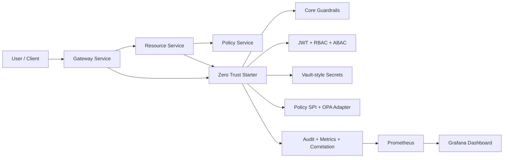

# Zero Trust Spring Boot Starter

This repository contains a diploma-oriented Zero Trust platform MVP for Spring Boot microservices. It is built as a reusable starter ecosystem plus a runnable demo landscape with gateway, resource service, policy service, integration tests, and observability.

## What is implemented

- `zero-trust-starter-core`
  - unified `zero-trust.*` property model
  - `STRICT`, `BALANCED`, and `DEV` operating modes
  - startup guardrails for missing JWT config, wildcard public paths, permissive CORS, and broken outbound service-token modes
- `zero-trust-starter-security`
  - JWT resource-server auto-configuration
  - deny-by-default inbound security
  - RBAC for public, admin, and internal service endpoints
  - tenant-aware ABAC enforcement
  - unified JSON `401` and `403` responses
  - correlation-id propagation
  - outbound token propagation for `RestClient`, `WebClient`, and `RestTemplate`
  - service-token fallback for non-human identities
- `zero-trust-starter-secrets`
  - Vault-style secret backend abstraction
  - inline/demo backend for local scenarios
  - path/key-based secret resolution for service tokens
- `zero-trust-starter-policy`
  - policy SPI
  - OPA-like HTTP adapter for external authorization decisions
  - fail-open and fail-closed behavior
- `zero-trust-starter-observability`
  - structured security event publishing
  - Micrometer metrics
  - optional in-memory audit event store
- `zero-trust-demo`
  - gateway service
  - resource service
  - mock external policy service
  - Docker Compose demo with Prometheus and Grafana

## Why this project is meaningful

The project addresses a real microservice problem: teams often reimplement security plumbing in every service. JWT validation, outbound token propagation, audit logging, tenant checks, service identities, and security guardrails are usually duplicated and configured inconsistently.

This starter turns those concerns into a reusable baseline. The demo proves that the baseline is useful in practice:

- all endpoints are closed by default unless explicitly opened
- `ROLE_ADMIN` is enforced for administrative routes
- `ROLE_SERVICE` is enforced for internal service-to-service routes
- user JWTs are propagated between services
- gateway-to-resource calls can fall back to a service token for non-human requests
- service tokens can be resolved from a Vault-style secret path
- tenant context is enforced for multi-tenant endpoints
- authorization decisions can be delegated to an external OPA-like policy engine
- security events are logged and exported as metrics
- unsafe configuration fails fast on startup

## Architecture



## Key demo endpoints

Resource service:

- `GET /public/hello`
- `GET /api/me`
- `GET /api/policy/finance-report`
- `GET /admin/report`
- `GET /admin/audit/events`
- `GET /internal/service-ping`
- `GET /tenant/orders`

Gateway service:

- `GET /api/proxy/me`
- `GET /api/proxy/admin-report`
- `GET /api/proxy/audit-events`
- `GET /api/proxy/finance-report`
- `GET /api/proxy/tenant-orders`
- `GET /public/service-ping`

Policy service:

- `POST /opa/authorize`

## How to run tests

```powershell
$env:JAVA_HOME='C:\Users\ostas\.jdks\corretto-24.0.2'
$env:Path="$env:JAVA_HOME\bin;$env:Path"
mvn test -q
```

The test suite verifies:

- authentication failures and access denial
- admin access control
- gateway-to-resource user-token propagation
- service-token fallback
- Vault-style secret resolution for service tokens in starter-level tests
- tenant ABAC enforcement
- tenant-context propagation through the gateway
- external policy allow and deny decisions
- fail-closed and fail-open behavior for policy engine outages
- security-event metrics emission
- startup guardrails
- admin access to the audit event feed

## Local run with Spring profiles

The demo configuration is now moved into [`application.yml`](/C:/Users/ostas/IdeaProjects/diploma/zero-trust-demo/src/main/resources/application.yml). Each service can be started with a short Spring profile instead of a long command line.

Start the policy service:

```powershell
$env:JAVA_HOME='C:\Users\ostas\.jdks\corretto-17.0.7'
$env:Path="$env:JAVA_HOME\bin;$env:Path"
mvn -q -pl zero-trust-demo spring-boot:run -Dspring-boot.run.main-class=ostashko.diploma.zerotrust.demo.policy.PolicyServiceApplication -Dspring-boot.run.arguments="--spring.profiles.active=policy-local"
```

Start the resource service:

```powershell
$env:JAVA_HOME='C:\Users\ostas\.jdks\corretto-17.0.7'
$env:Path="$env:JAVA_HOME\bin;$env:Path"
mvn -q -pl zero-trust-demo spring-boot:run -Dspring-boot.run.main-class=ostashko.diploma.zerotrust.demo.resource.ResourceServiceApplication -Dspring-boot.run.arguments="--spring.profiles.active=resource-local"
```

Generate a service token for the gateway:

```powershell
$env:DEMO_VAULT_SERVICE_TOKEN = & .\scripts\generate-demo-jwt.ps1 -Subject gateway-local -Roles SERVICE
```

Start the gateway:

```powershell
$env:JAVA_HOME='C:\Users\ostas\.jdks\corretto-17.0.7'
$env:Path="$env:JAVA_HOME\bin;$env:Path"
mvn -q -pl zero-trust-demo spring-boot:run -Dspring-boot.run.main-class=ostashko.diploma.zerotrust.demo.gateway.GatewayServiceApplication -Dspring-boot.run.arguments="--spring.profiles.active=gateway-local"
```

Generate user tokens:

```powershell
.\scripts\generate-demo-jwt.ps1 -Subject security-admin -Roles ADMIN
.\scripts\generate-demo-jwt.ps1 -Subject fin-user -Roles USER -Department finance -TenantId acme
.\scripts\generate-demo-jwt.ps1 -Subject sales-user -Roles USER -Department sales -TenantId acme
```

## Docker Compose demo

The easiest way to run the whole diploma landscape is:

```powershell
.\scripts\start-demo-compose.ps1
```

This starts:

- gateway service on `http://localhost:8080`
- resource service on `http://localhost:8081`
- policy service on `http://localhost:8082`
- Prometheus on `http://localhost:9090`
- Grafana on `http://localhost:3000`

Grafana opens without login (anonymous access is enabled for the demo).

The Grafana dashboard is provisioned automatically from [zero-trust-overview.json](/C:/Users/ostas/IdeaProjects/diploma/infra/grafana/dashboards/zero-trust-overview.json).

To stop the platform:

```powershell
.\scripts\stop-demo-compose.ps1
```
