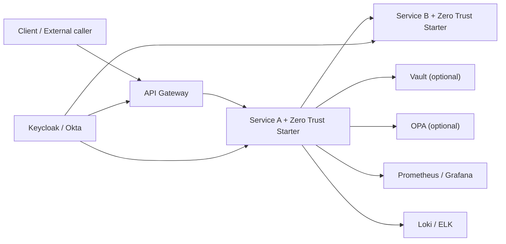

# Zero Trust Spring Boot Starter: проєктування

## 1. Призначення

### 1.1. Проблема
У типовій Spring Boot мікросервісній системі безпека збирається з багатьох окремих фрагментів:
- OAuth2 Resource Server для перевірки JWT.
- API Gateway для зовнішнього периметра.
- ручне прокидання токенів між сервісами;
- окремі фільтри для аудиту;
- окрема інтеграція з Vault;
- окремі правила ролей, CORS, заголовків, exception handling.

У результаті кожен сервіс конфігурується по-своєму. Це породжує дублювання, помилки та неконсистентність. Один сервіс може коректно валідувати issuer та audience, інший може перевіряти лише підпис, а третій взагалі залишить відкритий endpoint.

### 1.2. Мета starter-а
Створити Spring Boot Starter, який робить Zero Trust практичним для команди розробки:
- надає безпечні значення за замовчуванням;
- уніфікує конфігурацію безпеки у всіх сервісах;
- автоматизує типові інтеграції;
- блокує небезпечні конфігурації через fail-fast перевірки;
- підключається як звичайна залежність і не змушує команду щоразу писати однаковий код.

### 1.3. Головний принцип
Starter не замінює Keycloak, Vault, Istio, OPA чи API Gateway. Він є application-level security layer, який забезпечує, що будь-який Spring Boot сервіс поводиться відповідно до Zero Trust:
- нічому не довіряє за замовчуванням;
- перевіряє кожний вхідний і вихідний виклик;
- централізовано веде аудит;
- не стартує у небезпечному стані.

## 2. Цільовий результат

Після підключення starter-а типовий мікросервіс має отримати:
- `deny-by-default` для всіх endpoint-ів;
- автоматичну конфігурацію JWT Resource Server;
- уніфіковану обробку `401/403`;
- безпечні HTTP security headers;
- жорстку або явно задану CORS-політику;
- аудит подій автентифікації та авторизації;
- метрики безпеки через Micrometer;
- прокидання токена в міжсервісних викликах;
- базову підтримку service-to-service автентифікації;
- fail-fast валідацію критичних security-властивостей;
- розширення для Vault, OPA, tracing і multi-tenant контролю.

## 3. Межі рішення

### 3.1. Що starter робить
- автоматично конфігурує компоненти всередині Spring Boot застосунку;
- накладає єдиний контракт конфігурації;
- надає extension points для зовнішніх security-систем;
- забезпечує однакову поведінку сервісів.

### 3.2. Що starter не робить
- не випускає токени самостійно;
- не замінює IdP, наприклад Keycloak або Okta;
- не реалізує service mesh;
- не забезпечує mTLS на рівні мережі без зовнішньої інфраструктури;
- не замінює Vault або секрет-менеджер;
- не виконує повне керування політиками на рівні кластера.

## 4. Архітектурне бачення

### 4.1. Формат продукту
Рішення доцільно будувати не як один jar з усім підряд, а як сімейство starter-модулів з єдиним ядром.

Рекомендована структура:

1. `zero-trust-starter-core`
2. `zero-trust-starter-security`
3. `zero-trust-starter-observability`
4. `zero-trust-starter-secrets`
5. `zero-trust-starter-policy-opa` (опційно)
6. `zero-trust-starter-test`
7. `zero-trust-bom`
8. `zero-trust-samples`

### 4.2. Чому багатомодульність краща
- дає змогу не тягнути зайві залежності;
- дозволяє почати з MVP;
- спрощує тестування і підтримку;
- робить стартер гнучким: одна команда використовує лише JWT + audit, інша додає Vault і OPA.

### 4.3. Мінімальний MVP
Для дипломної роботи реалістично виділити MVP:
- `core`;
- `security`;
- `observability`;
- `test`;
- 1-2 demo-сервіси.

Vault, OPA та service-token exchange можна реалізувати як Phase 2.

## 5. Високорівнева схема



Starter працює всередині `Service A` і `Service B`, забезпечуючи єдину безпекову поведінку.

## 6. Логічні модулі

## 6.1. `core`
Відповідає за базові абстракції, властивості і guardrails.

Основні складові:
- `ZeroTrustProperties`;
- `ZeroTrustMode` (`STRICT`, `BALANCED`, `DEV`);
- `StartupSecurityValidator`;
- загальні моделі security event;
- utility-класи для кореляції, tenant context, masked logging;
- auto-configuration imports.

Відповідальність:
- читати конфігурацію;
- валідовувати її;
- надавати спільні SPI/інтерфейси;
- вмикати fail-fast.

## 6.2. `security`
Центральний модуль для inbound і outbound security.

Складові:
- `SecurityFilterChain` з deny-by-default;
- JWT decoder/validator wiring;
- authority mapping;
- exception handling для `401/403`;
- CORS/headers/CSRF policy;
- outbound token propagation;
- outbound service-token strategy;
- method security helpers;
- multi-tenant access evaluator.

## 6.3. `observability`
Модуль для аудиту, trace correlation і метрик.

Складові:
- `AuthenticationEventListener`;
- `AuthorizationAuditFilter`;
- `SecurityObservationConvention`;
- `MeterBinder` для security metrics;
- маскування чутливих полів;
- correlation ID enrichment.

## 6.4. `secrets`
Модуль інтеграції з зовнішніми secret stores.

Складові:
- auto-detection Vault integration;
- policy перевірок на plaintext secrets;
- abstraction `SecretProvider`;
- hooks для service credentials.

## 6.5. `policy-opa`
Опційний модуль для externalized authorization.

Складові:
- OPA client;
- request-to-policy input mapper;
- cache для policy decisions;
- fallback policy strategy.

## 6.6. `test`
Тестовий starter для прискорення інтеграційних тестів.

Складові:
- mock JWT builders;
- test annotations типу `@WithMockJwt`;
- test containers helpers для Keycloak/Vault/OPA;
- assertions для audit та metrics.

## 7. Конфігураційна модель

Уся конфігурація має бути згрупована під одним префіксом:

```yaml
zero-trust:
  enabled: true
  mode: STRICT
  inbound:
    enabled: true
    jwt:
      issuer-uri: https://idp.example.com/realms/main
      jwk-set-uri: https://idp.example.com/realms/main/protocol/openid-connect/certs
      audiences:
        - diploma-services
      principal-claim: preferred_username
      authorities-claim: roles
    public-paths:
      - /actuator/health
      - /actuator/info
    admin-paths:
      - /admin/**
  outbound:
    enabled: true
    propagation:
      mode: USER_TOKEN
    service-auth:
      enabled: true
      mode: CLIENT_CREDENTIALS
      registration-id: internal-api
  audit:
    enabled: true
    log-success: true
    log-failures: true
    include-client-ip: true
    mask-claims:
      - email
      - phone
  observability:
    metrics:
      enabled: true
    tracing:
      enabled: true
      expose-trace-id-header: true
  secrets:
    enabled: false
    fail-on-plaintext-secrets: true
  policy:
    opa:
      enabled: false
      url: http://opa:8181
      path: /v1/data/http/authz/allow
  guardrails:
    fail-on-missing-issuer: true
    fail-on-http-in-prod: true
    warn-on-permissive-cors: true
```

### 7.1. Принципи конфігурації
- один простір імен: `zero-trust.*`;
- без розкидання критичних параметрів по десятках різних namespace;
- sensible defaults;
- явне відокремлення inbound/outbound/audit/secrets/policy;
- будь-яка небезпечна опція вимагає явного ввімкнення.

## 8. Inbound security

## 8.1. Базова політика
Базова політика має бути такою:
- усі запити заблоковані за замовчуванням;
- доступ дозволяється лише для:
  - публічних path-ів, явно перелічених у конфігу;
  - автентифікованих запитів з валідним токеном;
  - запитів, що проходять RBAC/ABAC правила.

Це ключова вимога Zero Trust Starter-а.

## 8.2. JWT Resource Server
Starter має автоматично:
- увімкнути `oauth2ResourceServer().jwt()`;
- сконфігурувати `JwtDecoder`;
- перевіряти:
  - підпис токена;
  - `iss`;
  - `aud`;
  - `exp`;
  - `nbf` за наявності;
  - тип токена, якщо це потрібно;
- перетворювати claims у authorities за єдиним правилом.

### 8.2.1. Fail-fast логіка
Сервіс не має стартувати, якщо:
- `zero-trust.inbound.enabled=true`, але не задано `issuer-uri` або еквівалент;
- задані порожні audiences у `STRICT` режимі;
- конфігурація суперечлива, наприклад одночасно вимкнено JWT і не задано альтернативний механізм автентифікації.

## 8.3. RBAC
Starter повинен підтримувати рольову модель з конфігурації.

Приклад:
- `/admin/**` -> `ROLE_ADMIN`
- `/internal/**` -> `ROLE_SERVICE`
- `/api/**` -> будь-який автентифікований користувач

Рекомендована модель:
- ролі мапляться з JWT claim;
- префікс ролей задається конфігураційно;
- однакова логіка застосовується в усіх сервісах.

## 8.4. ABAC і multi-tenant
Starter має підтримувати policy templates, а не лише ролі.

Мінімальний набір шаблонів:
- `tenant-must-match`;
- `subject-must-match-path-variable`;
- `scope-required`.

Приклад ідеї:
- якщо токен містить `tenantId=acme`, а запит звертається до `/api/tenants/acme/orders`, доступ дозволено;
- якщо path містить інший tenant, доступ забороняється автоматично.

Це дає сильну перевагу для дипломної роботи, бо демонструє, що starter підтримує не лише простий RBAC, а і контекстну авторизацію.

## 8.5. Exception handling
Starter має надавати єдиний JSON-формат помилок.

Рекомендована структура:

```json
{
  "timestamp": "2026-03-16T21:00:00Z",
  "status": 403,
  "error": "ACCESS_DENIED",
  "message": "Access is denied for this resource",
  "path": "/api/orders/42",
  "traceId": "7a91d1b0fd..."
}
```

Переваги:
- однакова інтеграція для фронтенду;
- однаковий формат журналювання;
- легше аналізувати інциденти.

## 8.6. HTTP security defaults
Starter має автоматично:
- вмикати HSTS для HTTPS;
- задавати `X-Content-Type-Options: nosniff`;
- задавати `X-Frame-Options: DENY`;
- задавати `Referrer-Policy`;
- опційно налаштовувати `Content-Security-Policy` для gateway/UI backend;
- жорстко контролювати CORS;
- явно керувати CSRF-поведінкою.

Для REST API типова логіка:
- CSRF вимкнено, якщо сервіс статeless і працює з bearer token;
- CORS закрито, якщо origins не задані;
- відкриті origins дозволяються лише явно.

## 9. Outbound security

## 9.1. Token propagation
Якщо сервіс викликає інший сервіс у контексті користувача, starter має автоматично передавати поточний JWT.

Потрібно покрити:
- `RestClient` / `RestTemplate`;
- `WebClient`;
- `Feign`.

Механізм:
- дістаємо authentication з `SecurityContext`;
- якщо наявний bearer token, додаємо `Authorization: Bearer ...`;
- додаємо `X-Correlation-Id` або використовуємо trace context;
- за потреби додаємо `X-Tenant-Id`.

## 9.2. Service-to-service authentication
Не всі виклики виконуються від імені користувача. Для системних задач потрібна non-human identity.

Starter має підтримувати стратегії:

1. `USER_TOKEN`
2. `CLIENT_CREDENTIALS`
3. `TOKEN_EXCHANGE`
4. `STATIC_SERVICE_TOKEN` через секрет-сховище

### 9.2.1. USER_TOKEN
Поточний JWT просто прокидається далі. Підходить для request chain.

### 9.2.2. CLIENT_CREDENTIALS
Starter автоматично отримує access token для сервісу як OAuth2 client і підставляє його в outbound request.

### 9.2.3. TOKEN_EXCHANGE
Якщо IdP підтримує token exchange, starter може міняти user token на service-scoped token.

### 9.2.4. STATIC_SERVICE_TOKEN
Fallback варіант для внутрішніх інтеграцій, коли токен або API key зчитується з Vault.

## 9.3. Вибір стратегії
Вибір має бути можливий:
- глобально для сервісу;
- для окремого клієнта;
- для конкретного виклику через API starter-а.

## 9.4. TLS і сертифікати
Starter не повинен імітувати service mesh, але може:
- перевіряти, що outbound URL використовують HTTPS у `STRICT` режимі;
- надавати hooks для кастомного trust store;
- дозволяти інтеграцію з mTLS, якщо сертифікати вже надані інфраструктурою.

## 10. Аудит і спостережуваність

## 10.1. Події, які треба логувати
Мінімум:
- успішна автентифікація;
- невдала автентифікація;
- відмова в доступі;
- доступ до адміністративних endpoint-ів;
- outbound виклик з service identity;
- fail-fast помилка конфігурації;
- виявлення небезпечної конфігурації.

## 10.2. Структура audit event
Єдиний контракт події:
- `eventType`;
- `timestamp`;
- `serviceName`;
- `environment`;
- `principal`;
- `subjectType` (`USER`, `SERVICE`, `ANONYMOUS`);
- `clientIp`;
- `httpMethod`;
- `path`;
- `decision` (`ALLOW`, `DENY`);
- `reason`;
- `traceId`;
- `tenantId`;
- `authorities`.

### 10.2.1. Маскування
Starter повинен гарантувати:
- жодні bearer tokens не потрапляють у лог;
- секрети не логуються;
- PII маскується або опускається;
- stack trace на security exceptions не ллється безконтрольно в info-рівень.

## 10.3. Метрики
Через Micrometer варто віддавати:
- `security.authentication.success.count`;
- `security.authentication.failure.count`;
- `security.authorization.denied.count`;
- `security.outbound.token.propagation.count`;
- `security.service.token.acquisition.failure.count`;
- `security.guardrail.violation.count`.

Теги:
- `service`;
- `environment`;
- `endpointGroup`;
- `reason`;
- `authType`.

## 10.4. Tracing
Starter має інтегрувати security-події з trace context:
- збагачувати логи `traceId` і `spanId`;
- опційно додавати `traceId` у response header;
- пов’язувати inbound `401/403` з конкретним trace.

## 11. Робота з секретами

## 11.1. Secret abstraction
Потрібен інтерфейс:
- `SecretProvider`

Можливі реалізації:
- `VaultSecretProvider`;
- `EnvironmentSecretProvider`;
- `CompositeSecretProvider`.

Це дозволяє не жорстко прив’язувати стартер лише до Vault.

## 11.2. Поведінка для Vault
Starter може:
- підключатися до Vault через стандартний Spring механізм;
- стандартизувати шляхи пошуку секретів, наприклад:
  - `secret/{application}/{profile}`
  - `secret/shared/security`
- надавати utility для service credentials;
- перевіряти, чи не продубльовано секрет у plaintext конфігурації.

## 11.3. Guardrails для секретів
У `STRICT` режимі starter має:
- попереджати або падати, якщо знайдено властивості на кшталт `password`, `secret`, `token`, `api-key` у відкритому вигляді;
- дозволяти whitelist для dev/test середовищ;
- писати аудит-подію про небезпечну конфігурацію.

## 12. Guardrails і режими безпеки

## 12.1. Режими
Рекомендовано три режими:

### `STRICT`
Для production-like середовищ:
- fail-fast на будь-якій критичній проблемі;
- жорсткий deny-by-default;
- заборона HTTP для зовнішніх адрес;
- обов’язковий issuer;
- обов’язковий audit;
- заборона permissive CORS.

### `BALANCED`
Для staging та інтеграційних середовищ:
- частина проблем як warning;
- дозволено трохи більше гнучкості;
- зберігаються ключові перевірки JWT і deny-by-default.

### `DEV`
Для локальної розробки:
- більше попереджень, менше жорстких падінь;
- усе ще логуються небезпечні налаштування;
- відсутня мовчазна деградація безпеки.

## 12.2. Guardrail rules
Приклади правил:
- відсутній `issuer-uri`;
- дозволений `/**` як public-path;
- `CORS=*` у `STRICT`;
- HTTPS вимкнений у `STRICT`;
- `security disabled` у production profile;
- використовується plaintext secret;
- неактивне логування security events;
- outbound HTTP замість HTTPS для internal API.

## 13. Інтеграція з OPA

OPA не варто робити обов’язковим, але стартер повинен бути готовий до цього.

### 13.1. Модель
Запит до сервісу перетворюється в input:
- principal;
- roles;
- tenant;
- path;
- method;
- resource attributes;
- request metadata.

OPA повертає:
- `allow/deny`;
- причину;
- додаткові obligations за потреби.

### 13.2. Локальна роль starter-а
Starter:
- збирає input;
- викликає OPA;
- кешує рішення короткоживуче;
- уніфікує помилки;
- логірує policy decision.

## 14. Extension points

Щоб стартер був придатним для різних команд, потрібні точки розширення:
- `AuthorityMapper`;
- `TenantResolver`;
- `SecurityEventPublisher`;
- `PolicyDecisionProvider`;
- `ServiceTokenProvider`;
- `PlaintextSecretDetector`;
- `SecurityErrorResponseCustomizer`.

Це дозволяє не форкати starter при кожній новій вимозі.

## 15. Автоконфігурація

Starter має використовувати звичний для Spring Boot механізм auto-configuration.

Принципи:
- усе вмикається через `@ConditionalOnClass`, `@ConditionalOnProperty`, `@ConditionalOnMissingBean`;
- користувач може перевизначити будь-який bean;
- дефолти працюють без зайвого коду;
- кожна функція може бути вимкнена конфігураційно.

Приклади автоконфігурацій:
- `ZeroTrustCoreAutoConfiguration`;
- `ZeroTrustResourceServerAutoConfiguration`;
- `ZeroTrustOutboundSecurityAutoConfiguration`;
- `ZeroTrustAuditAutoConfiguration`;
- `ZeroTrustVaultAutoConfiguration`;
- `ZeroTrustOpaAutoConfiguration`.

## 16. Сценарії використання

## 16.1. Простий бізнес-сервіс
Сервіс підключає starter і отримує:
- JWT захист;
- deny-by-default;
- audit;
- стандартні `401/403`.

Це найпростіший сценарій MVP.

## 16.2. Сервіс-агрегатор
Сервіс приймає user JWT і викликає 2-3 сусідніх сервіси.

Starter:
- перевіряє вхідний токен;
- автоматично прокидає його далі;
- записує аудит;
- додає trace correlation.

## 16.3. Scheduler або batch-сервіс
Немає користувача, але є міжсервісні виклики.

Starter:
- отримує service token;
- виконує outbound автентифікацію;
- логірує, що діяв `SERVICE` principal.

## 16.4. Multi-tenant API
Сервіс захищає дані орендарів.

Starter:
- дістає `tenantId` з JWT;
- зіставляє його з path/header;
- блокує cross-tenant доступ;
- журналює порушення політики.

## 17. Нефункціональні вимоги

Starter має відповідати таким вимогам:
- мінімальний boilerplate для інтеграції;
- передбачувані дефолти;
- низький runtime overhead;
- сумісність з синхронним і реактивним стеком;
- відсутність vendor lock-in;
- testability;
- чітка документація;
- безпечна деградація: якщо модуль вимкнений, це видно явно.

## 18. Пропонована структура Maven-проєкту

Коли перейдете до реалізації, доцільно перетворити поточний порожній проєкт на multi-module build:

1. `zero-trust-parent`
2. `zero-trust-bom`
3. `zero-trust-starter-core`
4. `zero-trust-starter-security`
5. `zero-trust-starter-observability`
6. `zero-trust-starter-secrets`
7. `zero-trust-starter-policy-opa`
8. `zero-trust-starter-test`
9. `samples/sample-gateway`
10. `samples/sample-order-service`
11. `samples/sample-inventory-service`

Для диплома достатньо 2 demo-сервісів:
- `gateway`;
- `resource-service`;
- або `service-a` / `service-b`.

## 19. Дорожня карта реалізації

## Phase 1. Архітектурний каркас
- створити multi-module структуру;
- виділити `core` properties;
- реалізувати fail-fast validator;
- оформити базову документацію.

## Phase 2. Inbound security MVP
- resource server;
- deny-by-default;
- `401/403` handler;
- security headers;
- public/admin path rules.

## Phase 3. Observability MVP
- audit events;
- metrics;
- trace correlation.

## Phase 4. Outbound security
- token propagation;
- service token provider;
- клієнтські інтеграції для WebClient/Feign/RestClient.

## Phase 5. Secrets
- інтеграція з Vault;
- plaintext secret detection.

## Phase 6. Advanced policy
- ABAC templates;
- OPA integration;
- multi-tenant helpers.

## 20. Тестова стратегія

Для starter-а критично важливі не лише unit-тести, а й інтеграційні.

### 20.1. Що перевіряти
- сервіс не стартує без `issuer-uri`;
- `public-path` працює, інші path-и закриті;
- невалідний JWT дає `401`;
- валідний JWT без ролі дає `403`;
- валідний JWT з роллю дає `200`;
- outbound token propagation працює;
- security events пишуться;
- metrics інкрементуються;
- `STRICT` режим блокує небезпечну конфігурацію.

### 20.2. Рівні тестування
- unit tests для validator-ів та mapper-ів;
- slice tests для security config;
- integration tests з Testcontainers;
- contract tests для JSON error format;
- sample-based smoke tests.

## 21. Наукова та практична цінність для диплома

Цей starter має хорошу дипломну цінність, тому що поєднує:
- архітектурне узагальнення існуючих підходів;
- прикладне застосування Zero Trust в Spring Boot;
- стандартизацію security-конфігурації;
- автоматизацію best practices;
- зменшення human error;
- основу для кількісної оцінки.

Що можна вимірювати в дипломі:
- кількість рядків security-конфігурації до і після starter-а;
- час інтеграції нового сервісу;
- кількість типових помилок конфігурації, які ловить fail-fast;
- консистентність error responses;
- покриття security-подій audit-механізмом.

## 22. Головна ідея дизайну

Архітектурно правильний Zero Trust Starter має бути не "ще однією бібліотекою з фільтрами", а платформним security envelope для кожного мікросервісу.

Його ключові властивості:
- secure by default;
- deny by default;
- fail fast on insecure setup;
- consistent inbound/outbound security;
- observability as part of security;
- extensible integration with enterprise tooling.

## 23. Рекомендований scope для першої реалізації

Щоб не роздути першу версію, рекомендую включити в практичну реалізацію диплома саме це:
- JWT Resource Server;
- deny-by-default конфігурацію;
- RBAC rules;
- єдиний формат `401/403`;
- outbound token propagation;
- audit logging;
- security metrics;
- fail-fast validator;
- базовий plaintext secret detector.

А вже як розширення або future work:
- OPA;
- Vault deep integration;
- token exchange;
- mTLS-aware hooks;
- SPIFFE/SPIRE integration.

## 24. Підсумок

Запропонований starter закриває головний розрив, який видно в існуючих open-source підходах: між наявністю окремих security-інструментів і відсутністю єдиного, стандартизованого, secure-by-default способу підключити їх до кожного мікросервісу.

Саме тому для дипломної роботи доцільно позиціонувати цей проєкт як:
- уніфікуючий шар безпеки;
- reusable framework component;
- засіб стандартизації Zero Trust практик;
- інструмент зменшення конфігураційних помилок у Spring Boot мікросервісах.
